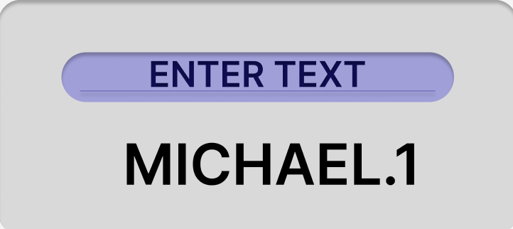

:warning: Everything between << >> needs to be replaced (remove << >> after replacing)

# << Project Title >>
## CS110 Final Project  << Semester, Year >>

## Team Members

John Bopp, Richie Dentico

***

## Project Description

<< Search Engine That Uses Voice Recognition >>

***    

## GUI Design

### Initial Design

### Final Design

## Program Design

### Features

1. << Voice input >>
2. << Using Duck Duck Go Api to return the top five search results>>
3. << Displaying Feedback the top five searches on a popup window >>

### Classes

- << You should have a list of each of your classes with a description >>

## ATP
Test 1 (Opening the Program):
Steps:
-User Types in python main.py in the terminal
-Results
-User should expect to see a text window with a search Bar

Test 2 (Search Bar Use):
Steps:
-User types their desired search into the search bar
-User presses search
Results:
-Window Closes
-User sees a pop up window with their information

Test 3 (Voice Command Correct)
Steps:
-User presses voice command button
-User waits to be prompted to speak by popup window and presses ok when ready
-User speaks into computer
-Popup window appears asking the user with what the computer heard and the user is asked if that is correct or not
-User selects yes and the window disapears
Results:
-User sees a pop up window with their information

Test 4 (Voice Command Incorrect, User then uses text search)
Steps:
-User presses voice command button
-User waits to be prompted to speak by popup window and presses ok when ready
-User speaks into computer
-Popup window appears asking the user with what the computer heard and the user is asked if that is correct or not
-User selects no and the window disapears
-Then the original window reopens and this time the user types in the search bar instead
-User types their desired search into the search bar
-User presses search, and the window Closes
Results:
-User sees a pop up window with their information

Test 5 (Voice Command Incorrect, User then uses voice search again)
Steps:
-User presses voice command button
-User waits to be prompted to speak by popup window and presses ok when ready
-User speaks into computer
-Popup window appears asking the user with what the computer heard and the user is asked if that is correct or not
-User selects no and the window disapears
-Then the original window reopens and the user repeats the previous steps for voice command.
Results:
-User sees a pop up window with their information

